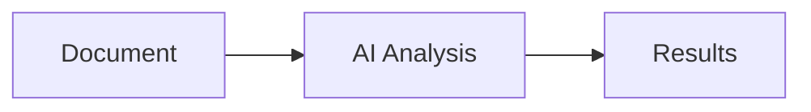

# eDiscovery Hypergraph Documentation

This directory contains the documentation for the eDiscovery Hypergraph platform, built with [Docusaurus](https://docusaurus.io/).

## 🚀 Quick Start

### Prerequisites

- Node.js 18.0 or above
- npm or yarn package manager

### Installation

```bash
cd docs
npm install
# or
yarn install
```

### Local Development

```bash
npm start
# or
yarn start
```

This command starts a local development server and opens up a browser window. Most changes are reflected live without having to restart the server.

### Build

```bash
npm run build
# or
yarn build
```

This command generates static content into the `build` directory and can be served using any static contents hosting service.

### Deployment

The documentation is automatically deployed to GitHub Pages when changes are pushed to the main branch. The deployment is handled by the GitHub Actions workflow in `.github/workflows/deploy-docs.yml`.

You can also manually deploy using:

```bash
# Using npm
npm run deploy

# Using yarn with SSH
USE_SSH=true yarn deploy

# Using yarn without SSH
GIT_USER=<Your GitHub username> yarn deploy
```

## 📁 Documentation Structure

```
docs/
├── docs/                    # Main documentation content
│   ├── index.md            # Home page
│   ├── getting-started.md  # Quick start guide
│   ├── architecture/       # Architecture documentation
│   ├── features/           # Feature guides
│   ├── api/               # API reference
│   ├── deployment/        # Deployment guides
│   └── ...
├── src/                    # Docusaurus theme customizations
│   ├── css/               # Custom CSS
│   └── pages/             # Custom React pages
├── static/                # Static assets
│   └── img/              # Images
├── docusaurus.config.ts   # Docusaurus configuration
├── sidebars.ts           # Sidebar configuration
└── package.json          # Dependencies
```

## ✏️ Writing Documentation

### Adding a New Page

1. Create a new `.md` or `.mdx` file in the appropriate directory under `docs/`
2. Add front matter to configure the page:

```markdown
---
title: Your Page Title
description: Page description for SEO
sidebar_position: 3
---

# Your Page Title

Your content here...
```

### Adding Code Examples

Use code blocks with syntax highlighting:

````markdown
```python
# Python example
async def process_document(doc):
    result = await analyze_document(doc)
    return result
```
````

### Adding Diagrams

Use Mermaid for diagrams:

````markdown

````

### Adding Images

Place images in `static/img/` and reference them:

```markdown

```

## 🎨 Customization

### Theme

Modify `src/css/custom.css` to customize the theme colors and styles.

### Configuration

Edit `docusaurus.config.ts` to change site metadata, navigation, and features.

### Sidebar

Configure the sidebar structure in `sidebars.ts`.

## 📚 Additional Resources

- [Docusaurus Documentation](https://docusaurus.io/)
- [Markdown Guide](https://www.markdownguide.org/)
- [MDX Documentation](https://mdxjs.com/)

## 🤝 Contributing

1. Fork the repository
2. Create a feature branch
3. Make your changes
4. Submit a pull request

All documentation contributions are welcome!
