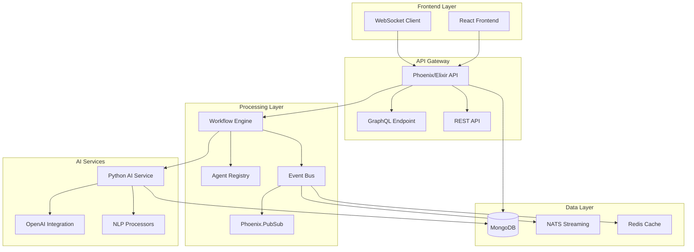
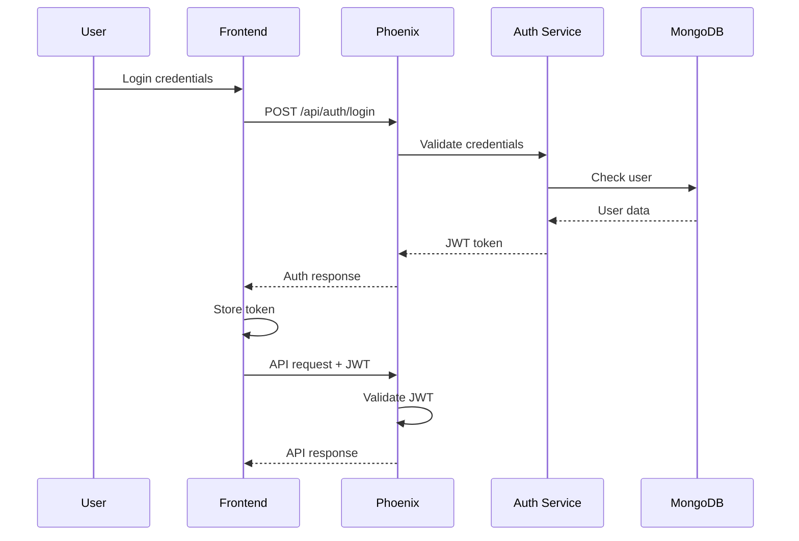

# Architecture Overview

The eDiscovery Hypergraph platform is built on a distributed, microservices architecture that combines the best of Elixir's fault-tolerant concurrent processing with Python's AI capabilities and modern web technologies.

## System Architecture



## Core Components

### 1. Frontend Layer

**React Application**
- Built with React 19 and TypeScript
- Material-UI components for consistent design
- Real-time updates via WebSocket
- Responsive design for desktop and mobile

**Key Features:**
- Document upload and management
- Real-time processing status
- Interactive entity relationship graphs
- Advanced search interface

### 2. Elixir/Phoenix Backend

**Phoenix Framework**
- Handles HTTP requests and WebSocket connections
- Manages user sessions and authentication
- Coordinates workflow execution
- Provides GraphQL and REST APIs

**Workflow Engine**
- Topological sorting for dependency resolution
- Concurrent operator execution
- Fault-tolerant processing with supervision trees
- Dynamic workflow composition

**Agent Registry**
- Service discovery for distributed agents
- Health monitoring and failover
- Load balancing across agent instances
- PubSub-based communication

### 3. Python AI Service

**FastAPI Application**
- Handles AI processing requests
- Manages OpenAI API integration
- Implements custom NLP algorithms
- Provides caching for expensive operations

**AI Capabilities:**
- Entity extraction (NER)
- Document classification
- Privilege detection
- Summarization
- Sentiment analysis

### 4. Data Storage

**MongoDB**
- Document-oriented storage for flexibility
- Indexes for fast searching
- GridFS for large file storage
- Change streams for real-time updates

**NATS Streaming**
- Distributed event streaming
- Message persistence and replay
- At-least-once delivery guarantee
- Horizontal scaling

## Communication Patterns

### Agent-to-Agent (A2A) Protocol

The platform uses a standardized JSON protocol for agent communication:

```json
{
  "id": "unique-message-id",
  "type": "request",
  "from": "agent-1",
  "to": "agent-2",
  "timestamp": "2024-01-20T10:00:00Z",
  "payload": {
    "action": "process_document",
    "data": {
      "document_id": "doc-123",
      "operations": ["extract", "classify", "summarize"]
    }
  }
}
```

### Event-Driven Architecture

Events flow through the system via Phoenix.PubSub and NATS:

1. **Document Upload Event**
   ```elixir
   Phoenix.PubSub.broadcast(
     MyApp.PubSub,
     "documents:new",
     {:document_uploaded, document_id}
   )
   ```

2. **Processing Status Updates**
   ```elixir
   EventBus.publish("processing.status", %{
     document_id: doc_id,
     status: :in_progress,
     progress: 0.75
   })
   ```

3. **Completion Notifications**
   ```elixir
   NATS.publish("ediscovery.complete", Jason.encode!(%{
     document_id: doc_id,
     results: analysis_results
   }))
   ```

## Scalability Strategies

### Horizontal Scaling

**Elixir Nodes**
- Distributed Erlang for clustering
- Automatic node discovery
- Shared-nothing architecture
- Location transparency

**Python Workers**
- Stateless design for easy scaling
- Load balancing via NATS queue groups
- Auto-scaling based on queue depth
- Resource pooling for API connections

### Vertical Scaling

**Concurrency**
- Elixir's lightweight processes (millions per node)
- Python asyncio for I/O-bound operations
- Connection pooling for databases
- Batch processing for efficiency

## Security Architecture

### Authentication & Authorization



### Data Security

- **Encryption at Rest**: MongoDB encryption
- **Encryption in Transit**: TLS 1.3 for all connections
- **API Security**: JWT tokens with refresh rotation
- **Input Validation**: Schema validation at all entry points
- **Audit Logging**: Comprehensive activity tracking

## Performance Optimization

### Caching Strategy

```elixir
# Multi-level caching
defmodule CacheStrategy do
  # L1: Process-level cache (ETS)
  # L2: Redis distributed cache
  # L3: Database with indexes
  
  def get(key) do
    with nil <- ProcessCache.get(key),
         nil <- RedisCache.get(key),
         nil <- Database.get(key) do
      nil
    else
      value ->
        warm_caches(key, value)
        value
    end
  end
end
```

### Query Optimization

- GraphQL query complexity analysis
- DataLoader for N+1 query prevention
- Database query optimization
- Elasticsearch for full-text search

## Monitoring & Observability

### Metrics Collection

- Prometheus metrics endpoint
- Custom business metrics
- Performance tracking
- Resource utilization

### Distributed Tracing

- OpenTelemetry integration
- Request flow visualization
- Performance bottleneck identification
- Error tracking and alerting

### Logging

```elixir
# Structured logging
Logger.info("Document processed", 
  document_id: doc_id,
  duration_ms: duration,
  operations: ["extract", "classify"],
  user_id: user_id
)
```

## Deployment Architecture

### Container Architecture

```dockerfile
# Multi-stage build
FROM elixir:1.14-alpine AS builder
# Build stage...

FROM alpine:3.18 AS runtime
# Runtime stage...
```

### Kubernetes Deployment

```yaml
apiVersion: apps/v1
kind: Deployment
metadata:
  name: ediscovery-phoenix
spec:
  replicas: 3
  selector:
    matchLabels:
      app: phoenix
  template:
    spec:
      containers:
      - name: phoenix
        image: ediscovery/phoenix:latest
        resources:
          requests:
            memory: "512Mi"
            cpu: "500m"
          limits:
            memory: "1Gi"
            cpu: "1000m"
```

## Next Steps

- Learn about [Hypergraph Integration](/architecture/hypergraph-integration)
- Explore [System Components](/architecture/system-components) in detail
- Understand [AI Analysis](/features/ai-analysis) capabilities
- Review [API Documentation](/api/rest-api)