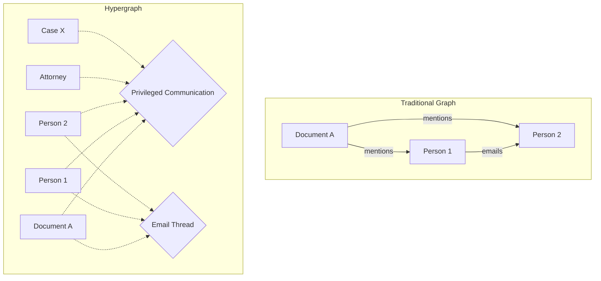

# Hypergraph Integration

The eDiscovery platform leverages hypergraph theory to model complex relationships between documents, entities, and legal concepts. This approach provides superior flexibility and accuracy compared to traditional graph-based systems.

## What is a Hypergraph?

Unlike traditional graphs where edges connect exactly two nodes, hypergraphs allow hyperedges to connect any number of nodes. This perfectly models legal scenarios where:

- Multiple parties are involved in a communication
- Documents reference multiple entities and concepts
- Legal privileges apply to groups of related documents
- Complex ownership and custody chains exist



## Implementation Architecture

### Hypergraph Data Model

```elixir
defmodule Hypergraph.Models do
  defmodule Node do
    @type t :: %__MODULE__{
      id: String.t(),
      type: atom(),
      properties: map(),
      created_at: DateTime.t(),
      updated_at: DateTime.t()
    }
    
    defstruct [:id, :type, :properties, :created_at, :updated_at]
  end
  
  defmodule Hyperedge do
    @type t :: %__MODULE__{
      id: String.t(),
      type: atom(),
      nodes: [String.t()],
      properties: map(),
      weight: float(),
      created_at: DateTime.t()
    }
    
    defstruct [:id, :type, :nodes, :properties, :weight, :created_at]
  end
  
  defmodule Hypergraph do
    @type t :: %__MODULE__{
      nodes: %{String.t() => Node.t()},
      hyperedges: %{String.t() => Hyperedge.t()},
      indices: map()
    }
    
    defstruct nodes: %{}, hyperedges: %{}, indices: %{}
  end
end
```

### MongoDB Schema

```javascript
// Nodes Collection
{
  "_id": "node-uuid",
  "type": "document",
  "properties": {
    "title": "Contract Agreement",
    "date": "2024-01-15",
    "author": "John Smith",
    "classification": "confidential"
  },
  "embedding": [0.123, -0.456, ...], // 1536-dim vector
  "created_at": "2024-01-20T10:00:00Z",
  "updated_at": "2024-01-20T10:00:00Z"
}

// Hyperedges Collection
{
  "_id": "edge-uuid",
  "type": "privilege_group",
  "nodes": ["node-1", "node-2", "node-3"],
  "properties": {
    "privilege_type": "attorney_client",
    "confidence": 0.95,
    "review_status": "pending"
  },
  "weight": 0.95,
  "created_at": "2024-01-20T10:00:00Z"
}
```

## Hypergraph Operations

### 1. Node Creation

```elixir
defmodule Hypergraph.Operations do
  def create_document_node(document) do
    node = %Node{
      id: generate_id(),
      type: :document,
      properties: %{
        title: document.title,
        content_hash: hash_content(document.content),
        extracted_entities: extract_entities(document.content),
        embedding: generate_embedding(document.content)
      },
      created_at: DateTime.utc_now()
    }
    
    Hypergraph.Store.insert_node(node)
  end
end
```

### 2. Hyperedge Creation

```elixir
def create_privilege_hyperedge(document_ids, privilege_type, confidence) do
  hyperedge = %Hyperedge{
    id: generate_id(),
    type: :privilege,
    nodes: document_ids,
    properties: %{
      privilege_type: privilege_type,
      confidence: confidence,
      detected_patterns: detect_privilege_patterns(document_ids)
    },
    weight: confidence,
    created_at: DateTime.utc_now()
  }
  
  Hypergraph.Store.insert_hyperedge(hyperedge)
end
```

### 3. Traversal Algorithms

```elixir
defmodule Hypergraph.Traversal do
  @doc """
  Find all documents connected through privilege hyperedges
  """
  def find_privileged_document_family(document_id) do
    # Start with the document node
    visited = MapSet.new([document_id])
    queue = :queue.from_list([document_id])
    
    traverse_privilege_edges(queue, visited, [])
  end
  
  defp traverse_privilege_edges(queue, visited, results) do
    case :queue.out(queue) do
      {:empty, _} -> 
        results
        
      {{:value, node_id}, rest_queue} ->
        # Find all hyperedges containing this node
        hyperedges = Hypergraph.Store.find_hyperedges_with_node(node_id)
        
        # Filter for privilege hyperedges
        privilege_edges = Enum.filter(hyperedges, &(&1.type == :privilege))
        
        # Get all connected nodes
        new_nodes = privilege_edges
          |> Enum.flat_map(& &1.nodes)
          |> Enum.reject(&MapSet.member?(visited, &1))
        
        # Update visited set and queue
        new_visited = Enum.reduce(new_nodes, visited, &MapSet.put(&2, &1))
        new_queue = Enum.reduce(new_nodes, rest_queue, &:queue.in(&1, &2))
        
        traverse_privilege_edges(new_queue, new_visited, results ++ new_nodes)
    end
  end
end
```

## Entity Resolution

### Hypergraph-based Entity Linking

```elixir
defmodule Hypergraph.EntityResolution do
  @doc """
  Merge entity nodes that represent the same real-world entity
  """
  def resolve_entities(hypergraph) do
    # Find potential duplicate entities
    entity_groups = hypergraph.nodes
      |> Enum.filter(fn {_, node} -> node.type == :entity end)
      |> group_by_similarity()
    
    # Create equivalence hyperedges
    Enum.each(entity_groups, fn group ->
      create_equivalence_hyperedge(group)
    end)
  end
  
  defp group_by_similarity(entities) do
    entities
    |> Enum.group_by(&normalize_entity_name(&1))
    |> Map.values()
    |> Enum.filter(&(length(&1) > 1))
  end
  
  defp create_equivalence_hyperedge(entity_nodes) do
    %Hyperedge{
      id: generate_id(),
      type: :entity_equivalence,
      nodes: Enum.map(entity_nodes, & &1.id),
      properties: %{
        canonical_name: extract_canonical_name(entity_nodes),
        aliases: extract_aliases(entity_nodes),
        confidence: calculate_similarity_score(entity_nodes)
      },
      weight: 1.0,
      created_at: DateTime.utc_now()
    }
  end
end
```

## Workflow Integration

### Hypergraph-Aware Operators

```elixir
defmodule Operators.HypergraphOperator do
  use Operator
  
  @impl true
  def execute(%{document_id: doc_id} = input, context) do
    # Load document node and its hypergraph neighborhood
    {:ok, subgraph} = Hypergraph.Store.load_subgraph(doc_id, depth: 2)
    
    # Analyze relationships
    analysis = %{
      related_entities: find_related_entities(subgraph, doc_id),
      privilege_groups: find_privilege_groups(subgraph, doc_id),
      communication_threads: find_communication_threads(subgraph, doc_id),
      relevance_score: calculate_relevance_score(subgraph, doc_id)
    }
    
    {:ok, Map.merge(input, analysis)}
  end
end
```

### Dynamic Workflow Composition

```elixir
defmodule Hypergraph.WorkflowComposer do
  @doc """
  Generate workflow based on hypergraph structure
  """
  def compose_workflow(document_ids) do
    # Analyze document relationships
    hypergraph = Hypergraph.Store.load_induced_subgraph(document_ids)
    
    # Determine required operators based on hyperedge types
    operators = determine_required_operators(hypergraph)
    
    # Generate workflow YAML
    workflow = %{
      name: "Dynamic Hypergraph Workflow",
      nodes: build_workflow_nodes(operators, hypergraph),
      edges: build_workflow_edges(operators, hypergraph)
    }
    
    {:ok, workflow}
  end
end
```

## Query Language

### HyperQL - Hypergraph Query Language

```elixir
# Find all documents in attorney-client privilege hyperedges
# with specific attorneys
query = """
  MATCH (d:document)-[:IN]->(h:hyperedge {type: 'privilege'})
  WHERE h.privilege_type = 'attorney_client'
    AND EXISTS((a:entity {type: 'attorney'})-[:IN]->(h))
    AND a.name IN ['John Smith', 'Jane Doe']
  RETURN d, h, COLLECT(a) as attorneys
"""

# Find communication threads involving multiple parties
query = """
  MATCH (h:hyperedge {type: 'communication_thread'})
  WHERE SIZE(h.nodes) > 3
    AND ALL(n IN h.nodes WHERE n.type = 'person' OR n.type = 'document')
  RETURN h, h.nodes
  ORDER BY h.created_at DESC
"""
```

## Performance Optimizations

### Indexing Strategy

```elixir
defmodule Hypergraph.Indices do
  def build_indices(hypergraph) do
    %{
      # Node type index
      by_type: build_type_index(hypergraph.nodes),
      
      # Hyperedge type index
      edge_by_type: build_edge_type_index(hypergraph.hyperedges),
      
      # Node-to-hyperedge index
      node_to_edges: build_node_edge_index(hypergraph),
      
      # Temporal index
      temporal: build_temporal_index(hypergraph),
      
      # Spatial embeddings index (using Annoy)
      embeddings: build_embedding_index(hypergraph.nodes)
    }
  end
end
```

### Caching Strategies

```elixir
defmodule Hypergraph.Cache do
  use GenServer
  
  # Cache frequently accessed subgraphs
  def get_subgraph(node_id, depth) do
    key = "subgraph:#{node_id}:#{depth}"
    
    case Redis.get(key) do
      nil ->
        subgraph = Hypergraph.Store.load_subgraph(node_id, depth: depth)
        Redis.setex(key, 3600, serialize(subgraph))
        subgraph
        
      cached ->
        deserialize(cached)
    end
  end
end
```

## Visualization

### D3.js Hypergraph Renderer

```javascript
class HypergraphVisualizer {
  constructor(container) {
    this.svg = d3.select(container);
    this.simulation = d3.forceSimulation();
  }
  
  renderHypergraph(data) {
    // Render nodes as circles
    const nodes = this.svg.selectAll('.node')
      .data(data.nodes)
      .enter().append('circle')
      .attr('r', d => this.getNodeRadius(d.type))
      .attr('fill', d => this.getNodeColor(d.type));
    
    // Render hyperedges as convex hulls
    const hyperedges = this.svg.selectAll('.hyperedge')
      .data(data.hyperedges)
      .enter().append('path')
      .attr('d', d => this.computeConvexHull(d.nodes))
      .attr('fill', d => this.getEdgeColor(d.type))
      .attr('opacity', 0.3);
  }
}
```

## Best Practices

### 1. Hyperedge Design

- Keep hyperedges focused on single relationships
- Use properties to store metadata
- Maintain reasonable hyperedge sizes (typically < 100 nodes)
- Index frequently queried hyperedge types

### 2. Performance Considerations

- Use batch operations for bulk imports
- Implement pagination for large result sets
- Cache computed subgraphs
- Use approximate algorithms for large-scale analytics

### 3. Data Consistency

- Validate hyperedge integrity on creation
- Implement cascading deletes carefully
- Use transactions for multi-step operations
- Regular consistency checks

## Next Steps

- Explore [System Components](/architecture/system-components)
- Learn about [AI Analysis](/features/ai-analysis) integration
- Review [Workflow](/features/workflows) capabilities
- Check [API Documentation](/api/rest-api) for hypergraph operations