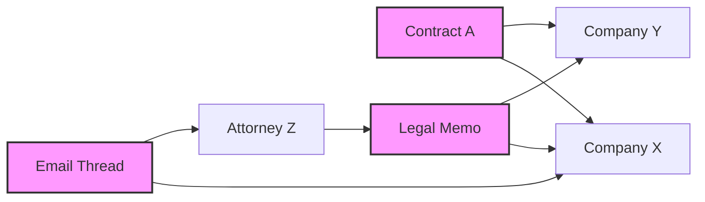

# AI Analysis

The eDiscovery Hypergraph platform leverages state-of-the-art AI models to provide comprehensive document analysis, extracting valuable insights that would take human reviewers weeks or months to discover.

## Overview

Our AI analysis pipeline combines multiple techniques:

- **Large Language Models (LLMs)**: OpenAI GPT-4 for understanding context and nuance
- **Named Entity Recognition (NER)**: Custom models for legal entity extraction
- **Classification Models**: Fine-tuned for privilege detection
- **Embedding Models**: For semantic search and similarity
- **Sentiment Analysis**: Understanding tone and intent

## Core Capabilities

### 1. Entity Extraction

Automatically identify and categorize entities mentioned in documents:

```python
# Example entity extraction result
{
  "entities": [
    {
      "text": "Acme Corporation",
      "type": "ORGANIZATION",
      "subtype": "COMPANY",
      "confidence": 0.98,
      "aliases": ["Acme Corp", "Acme"],
      "metadata": {
        "role": "defendant",
        "first_mention": 142,
        "frequency": 12
      }
    },
    {
      "text": "John Smith",
      "type": "PERSON",
      "subtype": "ATTORNEY",
      "confidence": 0.95,
      "metadata": {
        "bar_number": "CA123456",
        "firm": "Smith & Associates"
      }
    },
    {
      "text": "January 15, 2024",
      "type": "DATE",
      "normalized": "2024-01-15",
      "context": "contract_date"
    }
  ]
}
```

### 2. Privilege Classification

Identify potentially privileged communications with high accuracy:

```json
{
  "privilege_analysis": {
    "is_privileged": true,
    "privilege_type": "attorney_client",
    "confidence": 0.92,
    "factors": [
      {
        "factor": "attorney_present",
        "weight": 0.35,
        "evidence": "Email includes attorney John Smith"
      },
      {
        "factor": "legal_advice",
        "weight": 0.40,
        "evidence": "Contains request for legal counsel"
      },
      {
        "factor": "confidentiality_marker",
        "weight": 0.25,
        "evidence": "Marked as 'Confidential - Attorney Client'"
      }
    ],
    "recommended_action": "withhold",
    "review_required": false
  }
}
```

### 3. Document Summarization

Generate concise, accurate summaries of complex documents:

```python
async def summarize_document(document_text: str, options: SummaryOptions) -> Summary:
    """
    Generate AI-powered document summary
    """
    
    # Chunk long documents
    chunks = chunk_document(document_text, max_tokens=3000)
    
    # Generate summaries for each chunk
    chunk_summaries = []
    for chunk in chunks:
        summary = await openai_client.chat.completions.create(
            model="gpt-4-turbo",
            messages=[
                {
                    "role": "system",
                    "content": LEGAL_SUMMARY_PROMPT
                },
                {
                    "role": "user",
                    "content": f"Summarize this legal document section:\n\n{chunk}"
                }
            ],
            max_tokens=500
        )
        chunk_summaries.append(summary.choices[0].message.content)
    
    # Combine chunk summaries
    final_summary = await combine_summaries(chunk_summaries)
    
    return Summary(
        text=final_summary,
        key_points=extract_key_points(final_summary),
        legal_issues=identify_legal_issues(document_text),
        action_items=extract_action_items(document_text)
    )
```

### 4. Relationship Mapping

Discover hidden relationships between entities and documents:



## Configuration

### Model Selection

Configure AI models based on your needs:

```yaml
# config/ai_models.yaml
models:
  entity_extraction:
    primary: "spacy/en_legal_ner_lg"
    fallback: "openai/gpt-4"
    confidence_threshold: 0.85
    
  privilege_classification:
    model: "custom/privilege-bert-v2"
    ensemble:
      - "custom/privilege-bert-v2"
      - "openai/gpt-4"
    voting: "weighted"
    
  summarization:
    model: "openai/gpt-4-turbo"
    max_length: 500
    style: "legal_brief"
    
  embeddings:
    model: "openai/text-embedding-3-large"
    dimensions: 1536
```

### Processing Options

```elixir
defmodule AIConfig do
  @default_options %{
    parallel_processing: true,
    batch_size: 10,
    timeout_seconds: 30,
    retry_attempts: 3,
    cache_results: true,
    quality_mode: :balanced  # :fast | :balanced | :high_quality
  }
  
  def configure_for_case_type(case_type) do
    case case_type do
      :litigation -> 
        %{@default_options | quality_mode: :high_quality}
      
      :compliance ->
        %{@default_options | batch_size: 50, quality_mode: :fast}
        
      :investigation ->
        %{@default_options | parallel_processing: false, quality_mode: :high_quality}
    end
  end
end
```

## Advanced Features

### 1. Custom Entity Training

Train the system to recognize industry-specific entities:

```python
class CustomEntityTrainer:
    def train_model(self, training_data: List[TrainingExample]):
        """
        Fine-tune NER model for custom entities
        """
        # Load base model
        nlp = spacy.load("en_core_web_lg")
        
        # Add custom entity labels
        ner = nlp.get_pipe("ner")
        for label in ["PATENT_NUMBER", "TRADE_SECRET", "PRODUCT_NAME"]:
            ner.add_label(label)
        
        # Training loop
        optimizer = nlp.begin_training()
        for epoch in range(30):
            random.shuffle(training_data)
            losses = {}
            
            for batch in minibatch(training_data, size=8):
                texts = [example.text for example in batch]
                annotations = [example.entities for example in batch]
                
                nlp.update(texts, annotations, sgd=optimizer, losses=losses)
            
            print(f"Epoch {epoch}, Loss: {losses['ner']}")
        
        # Save trained model
        nlp.to_disk("./models/custom_legal_ner")
```

### 2. Contextual Understanding

Leverage document context for better analysis:

```python
async def analyze_with_context(
    document: Document,
    context_documents: List[Document]
) -> ContextualAnalysis:
    """
    Analyze document with surrounding context
    """
    
    # Build context window
    context = build_context_prompt(context_documents)
    
    # Perform contextual analysis
    response = await openai_client.chat.completions.create(
        model="gpt-4-turbo",
        messages=[
            {
                "role": "system",
                "content": """You are analyzing a legal document within the context 
                of related documents. Consider the broader context when extracting 
                information and making classifications."""
            },
            {
                "role": "user",
                "content": f"""Context documents:
                {context}
                
                Target document to analyze:
                {document.content}
                
                Please provide:
                1. How this document relates to the context
                2. Any references to other documents
                3. Timeline of events
                4. Key legal implications
                """
            }
        ]
    )
    
    return parse_contextual_response(response)
```

### 3. Multilingual Support

Process documents in multiple languages:

```python
SUPPORTED_LANGUAGES = {
    "en": "English",
    "es": "Spanish", 
    "fr": "French",
    "de": "German",
    "zh": "Chinese",
    "ja": "Japanese"
}

async def process_multilingual_document(document: Document) -> ProcessedDocument:
    # Detect language
    language = detect_language(document.content)
    
    if language not in SUPPORTED_LANGUAGES:
        raise UnsupportedLanguageError(f"Language {language} not supported")
    
    # Use language-specific models
    if language == "en":
        return await process_english_document(document)
    else:
        # Translate to English for processing
        translated = await translate_document(document, target_lang="en")
        
        # Process in English
        results = await process_english_document(translated)
        
        # Translate results back
        return await translate_results(results, target_lang=language)
```

### 4. Quality Assurance

Automated quality checks for AI results:

```elixir
defmodule QualityAssurance do
  @confidence_thresholds %{
    entity_extraction: 0.85,
    privilege_classification: 0.90,
    summarization: 0.80
  }
  
  def validate_results(ai_results) do
    validations = [
      validate_confidence_scores(ai_results),
      validate_entity_consistency(ai_results),
      validate_privilege_logic(ai_results),
      validate_summary_coverage(ai_results)
    ]
    
    case Enum.find(validations, &(&1 != :ok)) do
      nil -> {:ok, ai_results}
      {:error, reason} -> {:error, reason, ai_results}
    end
  end
  
  defp validate_confidence_scores(results) do
    low_confidence = Enum.filter(results.entities, fn entity ->
      entity.confidence < @confidence_thresholds.entity_extraction
    end)
    
    case low_confidence do
      [] -> :ok
      entities -> {:error, {:low_confidence_entities, entities}}
    end
  end
end
```

## Performance Optimization

### Caching Strategy

```python
from functools import lru_cache
import hashlib

class AICache:
    def __init__(self, redis_client):
        self.redis = redis_client
        self.ttl = 86400  # 24 hours
    
    def cache_key(self, operation: str, content: str) -> str:
        content_hash = hashlib.sha256(content.encode()).hexdigest()
        return f"ai:{operation}:{content_hash}"
    
    async def get_or_compute(
        self,
        operation: str,
        content: str,
        compute_func
    ):
        key = self.cache_key(operation, content)
        
        # Check cache
        cached = await self.redis.get(key)
        if cached:
            return json.loads(cached)
        
        # Compute and cache
        result = await compute_func(content)
        await self.redis.setex(
            key,
            self.ttl,
            json.dumps(result)
        )
        
        return result
```

### Batch Processing

```python
async def batch_process_documents(
    documents: List[Document],
    batch_size: int = 10
) -> List[ProcessedDocument]:
    """
    Process documents in optimized batches
    """
    results = []
    
    for i in range(0, len(documents), batch_size):
        batch = documents[i:i + batch_size]
        
        # Process batch in parallel
        batch_results = await asyncio.gather(*[
            process_document(doc) for doc in batch
        ])
        
        results.extend(batch_results)
        
        # Progress callback
        progress = (i + len(batch)) / len(documents)
        await notify_progress(progress)
    
    return results
```

## Monitoring & Analytics

### AI Performance Metrics

```python
class AIMetrics:
    def __init__(self):
        self.metrics = {
            "processing_time": Histogram(
                "ai_processing_duration_seconds",
                "Time spent in AI processing",
                ["operation", "model"]
            ),
            "accuracy": Gauge(
                "ai_accuracy_score",
                "AI model accuracy",
                ["model", "task"]
            ),
            "api_calls": Counter(
                "ai_api_calls_total",
                "Total AI API calls",
                ["provider", "model", "status"]
            )
        }
    
    def record_processing(self, operation, model, duration):
        self.metrics["processing_time"].labels(
            operation=operation,
            model=model
        ).observe(duration)
```

### Usage Analytics

```sql
-- Top AI operations by case
SELECT 
    c.name as case_name,
    ai.operation,
    COUNT(*) as operation_count,
    AVG(ai.processing_time) as avg_time,
    AVG(ai.confidence_score) as avg_confidence
FROM ai_operations ai
JOIN documents d ON ai.document_id = d.id
JOIN cases c ON d.case_id = c.id
WHERE ai.created_at > NOW() - INTERVAL '7 days'
GROUP BY c.name, ai.operation
ORDER BY operation_count DESC;
```

## Best Practices

### 1. Document Preparation

- **Text Extraction**: Ensure high-quality OCR for scanned documents
- **Formatting**: Preserve document structure for better analysis
- **Metadata**: Include all available metadata for context

### 2. Model Selection

- **Speed vs Accuracy**: Choose models based on case requirements
- **Cost Optimization**: Use simpler models for initial filtering
- **Ensemble Methods**: Combine models for critical decisions

### 3. Human-in-the-Loop

- **Review Thresholds**: Set confidence thresholds for human review
- **Feedback Loop**: Incorporate corrections to improve models
- **Audit Trail**: Maintain records of all AI decisions

### 4. Ethical Considerations

- **Bias Detection**: Regular audits for model bias
- **Transparency**: Explainable AI for legal defensibility
- **Data Privacy**: Ensure compliance with privacy regulations

## Next Steps

- Explore [Search Capabilities](/features/search)
- Learn about [Compliance Features](/features/compliance)
- Understand [Workflow Automation](/features/workflows)
- Review [API Documentation](/api/rest-api) for AI endpoints